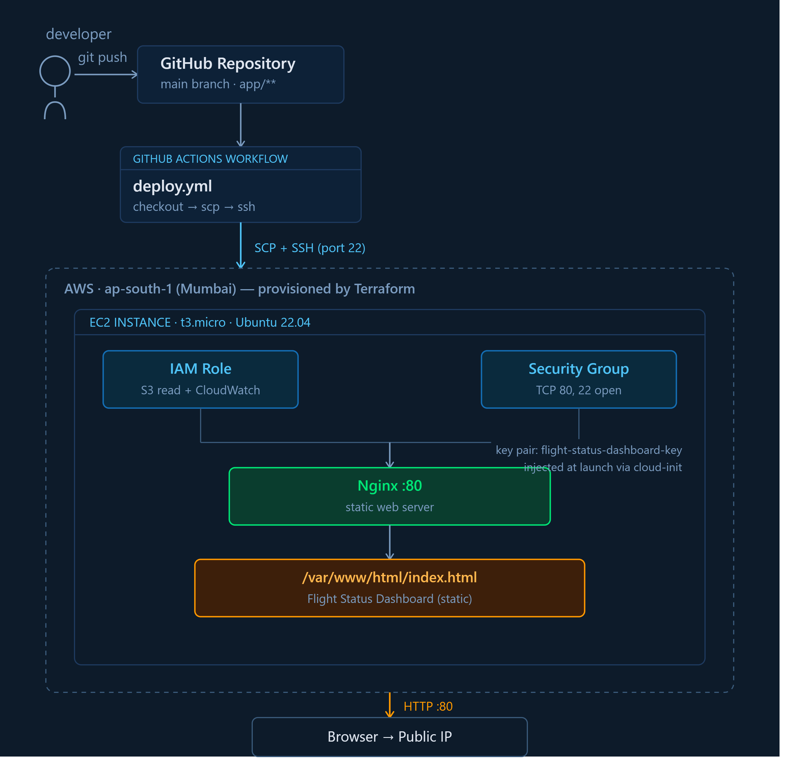

# Flight Status Dashboard — Cloud Deployment Project

A static Flight Status Dashboard deployed on AWS, fully provisioned using Terraform 
and automatically deployed via a GitHub Actions CI/CD pipeline.

Built as part of the Cloud Engineer Junior technical assessment for Siddhan Intelligence.

🔗 **Live URL:** http://13.127.197.143
🔗 **Repository:** https://github.com/Ragunathan2305/flight-status-dashboard

---

## 🏗️ Architecture



GitHub repo → push to `main` → GitHub Actions workflow (checkout → SCP → SSH) →
AWS EC2 instance (IAM role + Security Group attached) → Nginx → static dashboard →
accessible over public HTTP. All infrastructure provisioned by Terraform.

---

## 🛠️ Tech Stack

| Layer                   | Technology                          |
|--------------------------|--------------------------------------|
| Infrastructure as Code   | Terraform                           |
| Cloud Provider           | AWS                                  |
| Compute                  | EC2 (t3.micro, Free Tier eligible)   |
| Web Server               | Nginx                                |
| Application              | Static HTML/CSS/JS                   |
| CI/CD                    | GitHub Actions (SCP + SSH deploy)    |
| Region                   | ap-south-1 (Mumbai)                  |

---

## 📁 Project Structure
flight-status-dashboard/

├── terraform/

│   ├── main.tf            # EC2 instance, Security Group, SSH key pair

│   ├── iam.tf              # IAM Role, Policy, Instance Profile

│   ├── variables.tf        # Configurable values

│   └── outputs.tf          # Public IP, DNS, URL outputs

├── app/

│   └── index.html           # Flight Status Dashboard

├── .github/

│   └── workflows/

│       └── deploy.yml       # CI/CD pipeline

├── architecture-diagram.png

└── README.md

---

## 🚀 Setup & Deployment

### Prerequisites
- AWS account with Free Tier
- Terraform installed
- AWS CLI configured (`aws configure`)
- Git, and an SSH key pair for EC2 access

### 1. Clone the repository
```bash
git clone https://github.com/Ragunathan2305/flight-status-dashboard.git
cd flight-status-dashboard/terraform
```

### 2. Provision infrastructure
```bash
terraform init
terraform plan
terraform apply
```

This provisions, in order:
- An **IAM Role + Instance Profile** with least-privilege permissions (S3 read-only, CloudWatch logging)
- A **Security Group** allowing HTTP (80) and SSH (22)
- An **SSH key pair** resource, registered from a local public key
- An **EC2 instance** (t3.micro, Ubuntu 22.04) referencing all of the above, with Nginx installed automatically via a `user_data` boot script

### 3. Access the dashboard
```bash
terraform output website_url
```
Open the printed URL in your browser.

### 4. CI/CD — Automatic Deployment
On every push to `main` that touches the `app/` folder, GitHub Actions:
1. Checks out the repository
2. Copies `app/index.html` to the EC2 instance via SCP
3. SSHs in to move the file into Nginx's web root and reload Nginx

No manual redeployment is needed after the initial setup. Deployment credentials 
(SSH private key, host, user) are stored as encrypted GitHub Secrets, never committed to the repo.

---

## 🎯 Design Decisions

- **Static site over Flask/Node.js**: The assessment explicitly allows a static site. 
  Choosing static reduced complexity, letting effort focus on infrastructure quality, 
  IAM design, and CI/CD reliability — the areas this assessment actually evaluates.
- **EC2 over serverless (Lambda/S3 static hosting)**: The assessment specifically 
  requires deployment on a Virtual Machine with an IAM role attached, so EC2 was the 
  correct fit.
- **Terraform over manual console setup**: All infrastructure — including the SSH key 
  pair — is defined as code, version-controlled, and reproducible. No manual AWS 
  Console steps were used to provision resources.
- **Custom IAM Role (not broad managed policies)**: A purpose-built role was created 
  with only S3 read-only and CloudWatch logging permissions, rather than attaching a 
  broad policy like `AdministratorAccess`, following least privilege.
- **SSH key pair added as a dedicated Terraform resource (`aws_key_pair`)**: Rather 
  than creating it manually in the AWS Console, the key pair is provisioned from code 
  so the entire access setup is reproducible from a fresh `terraform apply`.
- **ap-south-1 (Mumbai) region**: The primary AWS region for India — enabled by 
  default, widest service availability, and low latency for users across India.

---

## ⚖️ Trade-offs Considered

| Decision | Trade-off |
|---|---|
| Static site vs. dynamic backend | Faster, fewer failure points; no real-time data — acceptable since the assessment only requires a "simple application" |
| EC2 vs. serverless | Matches the explicit VM requirement, but requires more operational management (patching, uptime) than serverless |
| SSH-based deploy (SCP/SSH) vs. AWS SSM | SSH is simpler to set up and widely understood, but requires keeping port 22 open and managing a private key in GitHub Secrets. **AWS Systems Manager (SSM) Session Manager was considered** as a more secure alternative — it avoids opening port 22 entirely and uses IAM-based access instead of long-lived keys — but was not implemented here due to assessment time constraints. This would be the recommended upgrade path for production. |
| Single EC2 instance vs. Auto Scaling Group | Simpler and sufficient for this scope; production would use an ASG + Load Balancer for high availability |
| IAM role includes baseline S3 read access | Not currently used by the static app itself; included as a realistic baseline for typical EC2 workloads (e.g., fetching config/assets). A stricter least-privilege version for this exact app would remove it entirely, since it's unused. |

---

## 💰 Cost Awareness

- **EC2 t3.micro**: Free Tier eligible (750 hours/month for 12 months on eligible accounts)
- **Estimated cost outside Free Tier**: ~$0.0104/hour (~$7.5/month) for t3.micro in ap-south-1
- **No additional always-on services**: No NAT Gateway, no Load Balancer, no managed database
- **Recommendation for production scale-up**: Use an Auto Scaling Group with mixed 
  Spot/On-Demand instances, and tear down idle dev/test environments via Terraform 
  (`terraform destroy`) when not in active use

---

## 🔒 Security Notes

- No credentials are hardcoded anywhere in the codebase
- AWS credentials used by Terraform are managed via the local AWS CLI profile, never committed
- The SSH private key used by GitHub Actions is stored as an encrypted GitHub Secret
- IAM role follows least-privilege principles (no write/delete permissions granted)
- Security Group restricts inbound traffic to only ports 80 (HTTP) and 22 (SSH)

---

## 👤 Author

**Ragunathan K**  
GitHub: [Ragunathan2305](https://github.com/Ragunathan2305)